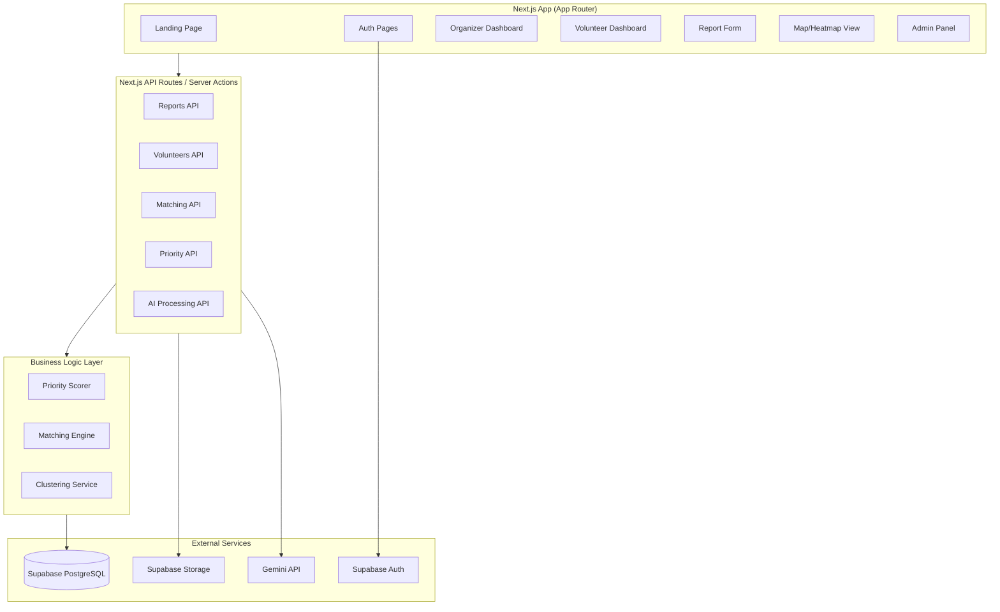

# CivicFlow — Implementation Plan

## Product Analysis

**What CivicFlow is:** A decision intelligence platform for community response. It consolidates fragmented community-need data (paper surveys, field reports, informal inputs) into structured intelligence, scores urgency transparently, matches volunteers using multi-factor scoring, and gives organizers a live operational dashboard.

**Key insight from Context.md:** This is NOT a volunteer management app. It's a *need intelligence* system. The core value chain is: **Raw Data → Structured Cases → Priority Scoring → Volunteer Matching → Assignment Tracking → Impact Visibility.**

### Design Risks & Hidden Assumptions Identified

1. **Supabase PostGIS dependency** — PostGIS extensions may not be available on all Supabase plans. **Decision:** Use standard lat/lng columns with Haversine distance calculation in-app. PostGIS is a future optimization, not a blocker.
2. **AI reliability** — Gemini API may hallucinate categories or urgency. **Decision:** All AI outputs are suggestions with confidence scores; human review is mandatory before finalization.
3. **Demo data quality** — Empty dashboards kill demos. **Decision:** Include a comprehensive seed script with realistic, geographically coherent data.
4. **Map performance** — Dense clusters can overwhelm Leaflet. **Decision:** Use marker clustering from the start.
5. **Auth complexity** — Full RBAC is expensive to build in a hackathon. **Decision:** Implement practical role-based guards (admin, organizer, volunteer) with Supabase auth + a `role` column on the users table.

> [!IMPORTANT]
> This is a hackathon project targeting the GDG Solution Challenge. The plan optimizes for **demo impact** while maintaining production-quality architecture. We'll use Supabase for everything (auth, DB, storage) to minimize infrastructure complexity.

---

## Technical Architecture



### Stack Choices

| Layer | Technology | Rationale |
|-------|-----------|-----------|
| Framework | Next.js 15 (App Router) | Single codebase, SSR, API routes, server actions |
| Language | TypeScript | Type safety across full stack |
| Styling | Tailwind CSS v4 | User explicitly requested; fast iteration |
| Components | shadcn/ui | Polished, accessible, customizable |
| Database | Supabase (PostgreSQL) | Auth + DB + Storage + Realtime in one |
| Forms | React Hook Form + Zod | Type-safe validation |
| Data Fetching | TanStack Query | Caching, optimistic updates, real-time sync |
| Charts | Recharts | Lightweight, React-native charting |
| Maps | Leaflet + react-leaflet | Free, no API key required, marker clustering |
| AI | Gemini API (server-side only) | Text extraction, classification, summarization |

---

## Database Schema

### Core Tables

**users** — Extends Supabase auth.users
- `id` (uuid, PK, references auth.users)
- `full_name`, `email`, `phone`, `role` (admin|organizer|volunteer|reporter)
- `avatar_url`, `organization`, `created_at`, `updated_at`

**volunteer_profiles**
- `id` (uuid, PK), `user_id` (FK → users)
- `skills` (text[]), `languages` (text[]), `availability` (jsonb)
- `latitude`, `longitude`, `radius_km` (float)
- `preferred_categories` (text[]), `experience_level`, `reliability_score`
- `max_concurrent_tasks`, `active_task_count`

**reports**
- `id` (uuid, PK), `title`, `description`, `raw_text`
- `source_type` (form|upload|field_note)
- `category`, `severity` (1-5), `urgency` (1-5)
- `affected_count`, `latitude`, `longitude`, `address`
- `status` (new|verified|in_progress|resolved|closed)
- `ai_summary`, `ai_confidence` (float)
- `submitted_by` (FK), `verified_by` (FK)
- `cluster_id` (FK), `created_at`, `updated_at`

**tasks**
- `id`, `report_id` (FK), `title`, `description`
- `required_skills` (text[]), `estimated_duration_hours`
- `latitude`, `longitude`, `priority_score` (float)
- `status` (open|assigned|in_progress|completed|cancelled)
- `assigned_volunteer_id` (FK), `created_by` (FK)

**assignments**
- `id`, `task_id` (FK), `volunteer_id` (FK)
- `match_score` (float), `match_breakdown` (jsonb)
- `status` (suggested|assigned|accepted|in_progress|completed|declined)
- `assigned_at`, `accepted_at`, `started_at`, `completed_at`
- `feedback`, `rating`

**clusters**
- `id`, `name`, `issue_type`, `latitude`, `longitude`
- `report_count`, `priority_score`, `status`, `last_updated`

**activity_logs**
- `id`, `entity_type`, `entity_id`, `action`, `actor_id`
- `details` (jsonb), `created_at`

**attachments**
- `id`, `report_id` (FK), `file_url`, `file_type`, `file_name`

---

## Proposed Changes

### Phase 1 — Project Scaffolding

#### [NEW] Project Root
- Initialize Next.js 15 with TypeScript, Tailwind CSS, App Router
- Install dependencies: `@supabase/supabase-js`, `@supabase/ssr`, `react-hook-form`, `@hookform/resolvers`, `zod`, `@tanstack/react-query`, `recharts`, `leaflet`, `react-leaflet`, `lucide-react`
- Install shadcn/ui and add core components (Button, Card, Input, Dialog, etc.)

#### [NEW] [.env.example](file:///d:/Hackathons/GDG%20Solution%20Challenge/CivicFlow/.env.example)
```
NEXT_PUBLIC_SUPABASE_URL=your_supabase_url
NEXT_PUBLIC_SUPABASE_ANON_KEY=your_anon_key
GEMINI_API_KEY=your_gemini_key
```

#### [NEW] [.gitignore](file:///d:/Hackathons/GDG%20Solution%20Challenge/CivicFlow/.gitignore)
- node_modules, .env*, .next, dist, build, *.log

---

### Phase 2 — Database Schema & Types

#### [NEW] [schema.sql](file:///d:/Hackathons/GDG%20Solution%20Challenge/CivicFlow/supabase/schema.sql)
Full SQL schema with all tables, indexes, RLS policies, and seed data.

#### [NEW] [src/lib/types/database.ts](file:///d:/Hackathons/GDG%20Solution%20Challenge/CivicFlow/src/lib/types/database.ts)
TypeScript types mirroring the database schema.

#### [NEW] [src/lib/supabase/](file:///d:/Hackathons/GDG%20Solution%20Challenge/CivicFlow/src/lib/supabase/)
- `client.ts` — Browser Supabase client
- `server.ts` — Server-side Supabase client
- `middleware.ts` — Auth middleware

---

### Phase 3 — Auth & Roles

#### [NEW] [src/app/(auth)/login/page.tsx](file:///d:/Hackathons/GDG%20Solution%20Challenge/CivicFlow/src/app/(auth)/login/page.tsx)
#### [NEW] [src/app/(auth)/signup/page.tsx](file:///d:/Hackathons/GDG%20Solution%20Challenge/CivicFlow/src/app/(auth)/signup/page.tsx)
#### [NEW] [src/middleware.ts](file:///d:/Hackathons/GDG%20Solution%20Challenge/CivicFlow/src/middleware.ts)
Role-based route protection.

---

### Phase 4 — Core Intake Module

#### [NEW] [src/app/(dashboard)/reports/new/page.tsx](file:///d:/Hackathons/GDG%20Solution%20Challenge/CivicFlow/src/app/(dashboard)/reports/new/page.tsx)
Report submission form with Zod validation, file upload, geocoding.

#### [NEW] [src/app/(dashboard)/reports/page.tsx](file:///d:/Hackathons/GDG%20Solution%20Challenge/CivicFlow/src/app/(dashboard)/reports/page.tsx)
Report list with filtering, sorting, status badges.

---

### Phase 5 — Volunteer Management

#### [NEW] [src/app/(dashboard)/volunteers/](file:///d:/Hackathons/GDG%20Solution%20Challenge/CivicFlow/src/app/(dashboard)/volunteers/)
Profile creation, skill tags, availability matrix, location preference.

---

### Phase 6 — Prioritization & Matching Engine

#### [NEW] [src/lib/engine/priority.ts](file:///d:/Hackathons/GDG%20Solution%20Challenge/CivicFlow/src/lib/engine/priority.ts)
Transparent priority scoring:
```
Score = (severity × 0.25) + (urgency × 0.25) + (affected_count_normalized × 0.15) + (recency × 0.10) + (confidence × 0.10) + (recurrence × 0.10) + (location_vulnerability × 0.05)
```

#### [NEW] [src/lib/engine/matching.ts](file:///d:/Hackathons/GDG%20Solution%20Challenge/CivicFlow/src/lib/engine/matching.ts)
Multi-factor matching:
```
Match = (skill_fit × 0.35) + (proximity × 0.20) + (availability × 0.15) + (category_pref × 0.10) + (reliability × 0.10) + (workload_balance × 0.10)
```

---

### Phase 7 — Dashboard & Map

#### [NEW] [src/app/(dashboard)/dashboard/page.tsx](file:///d:/Hackathons/GDG%20Solution%20Challenge/CivicFlow/src/app/(dashboard)/dashboard/page.tsx)
Organizer command center: KPI cards, urgent needs list, task queue, charts.

#### [NEW] [src/app/(dashboard)/map/page.tsx](file:///d:/Hackathons/GDG%20Solution%20Challenge/CivicFlow/src/app/(dashboard)/map/page.tsx)
Interactive Leaflet map with color-coded markers, clustering, and urgency heatmap.

---

### Phase 8 — AI Module

#### [NEW] [src/lib/ai/gemini.ts](file:///d:/Hackathons/GDG%20Solution%20Challenge/CivicFlow/src/lib/ai/gemini.ts)
Server-side Gemini API client for text extraction, classification, summarization.

#### [NEW] [src/app/api/ai/](file:///d:/Hackathons/GDG%20Solution%20Challenge/CivicFlow/src/app/api/ai/)
- `extract/route.ts` — Extract structured fields from raw text
- `summarize/route.ts` — Summarize reports
- `classify/route.ts` — Classify category and urgency

---

### Phase 9 — Analytics & Reporting

#### [NEW] [src/app/(dashboard)/analytics/page.tsx](file:///d:/Hackathons/GDG%20Solution%20Challenge/CivicFlow/src/app/(dashboard)/analytics/page.tsx)
Charts for resolved vs unresolved, category distribution, volunteer utilization, response times.

---

### Phase 10 — Landing Page & Polish

#### [NEW] [src/app/page.tsx](file:///d:/Hackathons/GDG%20Solution%20Challenge/CivicFlow/src/app/page.tsx)
Premium landing page with hero, features showcase, CTA.

---

## Verification Plan

### Automated Tests
Since this is a hackathon project, we'll verify primarily through browser-based testing:

1. **Build verification**: `npm run build` must pass with zero errors
2. **Dev server**: `npm run dev` must start without crashes

### Browser Verification (Primary)
For each phase, I will:

1. **Auth flow**: Navigate to `/login`, create account, verify redirect to dashboard
2. **Report submission**: Navigate to `/reports/new`, fill form, submit, verify appears in list
3. **Volunteer profile**: Create profile, verify skills/location saved
4. **Dashboard**: Verify KPI cards show correct counts, urgent needs list populated
5. **Map**: Verify markers render at correct locations, clustering works
6. **Matching**: Create task from report, verify matching scores display correctly
7. **AI**: Submit raw text, verify extracted fields populate the form
8. **Analytics**: Verify charts render with seed data

### Manual Verification (User)
After Phase 10, the user should:
1. Open app in browser → Verify landing page looks premium
2. Sign up as organizer → Submit 2-3 reports → Check dashboard updates
3. Create volunteer profile → Verify matching suggestions appear
4. Open map → Verify report pins and heatmap display
5. Open analytics → Verify charts populated with data
